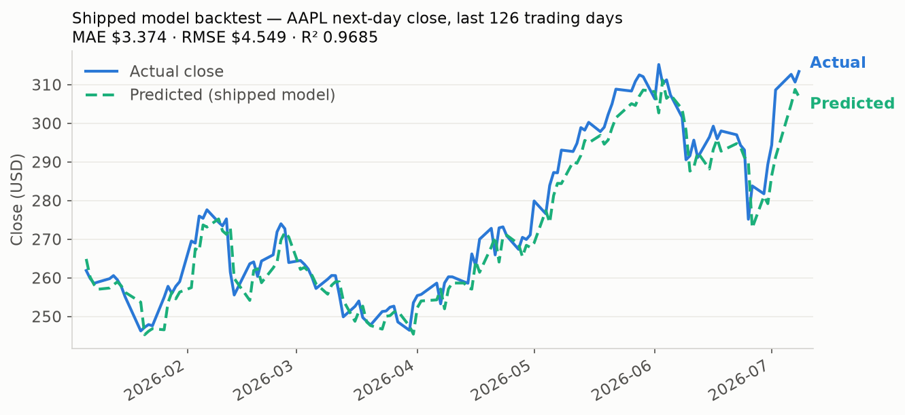

# 📈 Stock Price Predictor (Capstone 4 - ML Deployment)

[](https://opensource.org/licenses/MIT)
[](https://www.python.org/downloads/)
[](https://huggingface.co/spaces/Vineetha00/stock-price-predictor)

This project is an end-to-end machine learning pipeline that predicts the next day's stock closing price based on the previous day's closing value. It's built as part of my Capstone 4 project focusing on MLOps, model packaging, and web deployment — the point is the pipeline (training → joblib packaging → Gradio UI → Hugging Face deployment), with a deliberately simple model at its core.



## 📊 Results

Backtest of the shipped `model.joblib` on 250 trading days of real AAPL closes (Jul 2025 – Jul 2026, fetched from Yahoo Finance — reproduce with `python scripts/backtest.py`):

| Predictor | MAE | RMSE | R² |
|---|---|---|---|
| Shipped model (`StandardScaler + LinearRegression` on Lag1) | $3.37 | $4.55 | 0.969 |
| Naive persistence (tomorrow = today) | $2.83 | $4.00 | 0.976 |

**Honest read:** a Lag1 linear regression tracks the persistence baseline rather than beating it — as expected, since yesterday's close is nearly all the signal a single-lag feature carries. The R² is dominated by trend. This repo demonstrates the MLOps lifecycle around a model, not a trading edge; richer features (returns, volume, multi-lag windows) are the obvious next step.

---

## 🚀 Project Overview

- 📊 **Domain**: Finance / Time Series Analysis  
- 🧠 **Model**: Scikit-Learn Linear Regression with StandardScaler  
- 🛠 **Tech Stack**: Python, yfinance, scikit-learn, joblib, Gradio  
- ☁️ **Deployment**: Hugging Face Spaces (Gradio UI)

---

## 📂 Project Structure

```
finance-time-series-mlops/
│
├── app.py                # Gradio web app interface
├── model.joblib          # Trained ML pipeline
├── scripts/backtest.py   # Backtest the shipped model on real Yahoo Finance data
├── docs/backtest.png     # Predicted-vs-actual backtest plot (generated by the script)
├── requirements.txt      # Dependencies for deployment
├── LICENSE               # MIT
└── README.md             # Project summary
```

---

## 📦 Features

- Retrieves historical stock data using `yfinance`
- Trains a regression model to forecast the next day's price
- Saves the model using `joblib`
- Deploys a web UI using `Gradio` for real-time prediction

---

## 🧪 Sample Input

**Enter**: Last closing price (e.g., `170.50`)  
**Output**: `Predicted next close: $172.10`

---

## 🛠 Installation (For Local Use)

```bash
pip install -r requirements.txt
python app.py
```

---

## 🌐 Live Demo

📍 https://huggingface.co/spaces/Vineetha00/stock-price-predictor
✅ Launches a shareable web UI using Gradio.

---

## 🤖 Model Details

- **Pipeline**: `StandardScaler + LinearRegression`
- **Target**: Next day’s closing price
- **Feature**: Previous day's closing price (`Lag1`)
- **Data Source**: [Yahoo Finance](https://finance.yahoo.com)

---

## 👩‍💻 Author

**Vineetha V**  
MS in ECE - Machine Learning and Data Science  
University of Southern California  
🔗 [GitHub](https://github.com/vineetha00)

---

## 📝 License

This project is open-sourced under the [MIT License](LICENSE).
